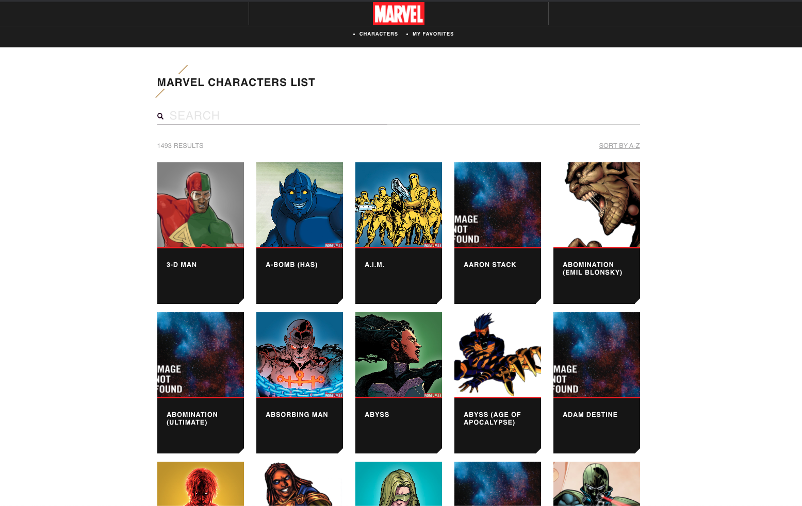

<h4 align="center"> 
    (Teste) - CI&T Front-End Developer ( Marvel API)
</h4>

## :rocket: Tecnologias
Este projeto foi desenvolvido com as seguintes tecnologias
 
- [React](https://reactjs.org)


## :page_with_curl: Como Usar
- **Clone o repositório**
- **Front-end** 
    - ```yarn```
    - ```yarn start``` `
- **Para Verificar Testes**
    - ```yarn```
    - ```yarn test``` `

## :computer: Front-End Web :heavy_check_mark:

<h1 align="center">
    
</h1>

## :memo: License

Esse projeto está sob a licença MIT. Veja o arquivo [LICENSE](LICENSE) para mais detalhes.